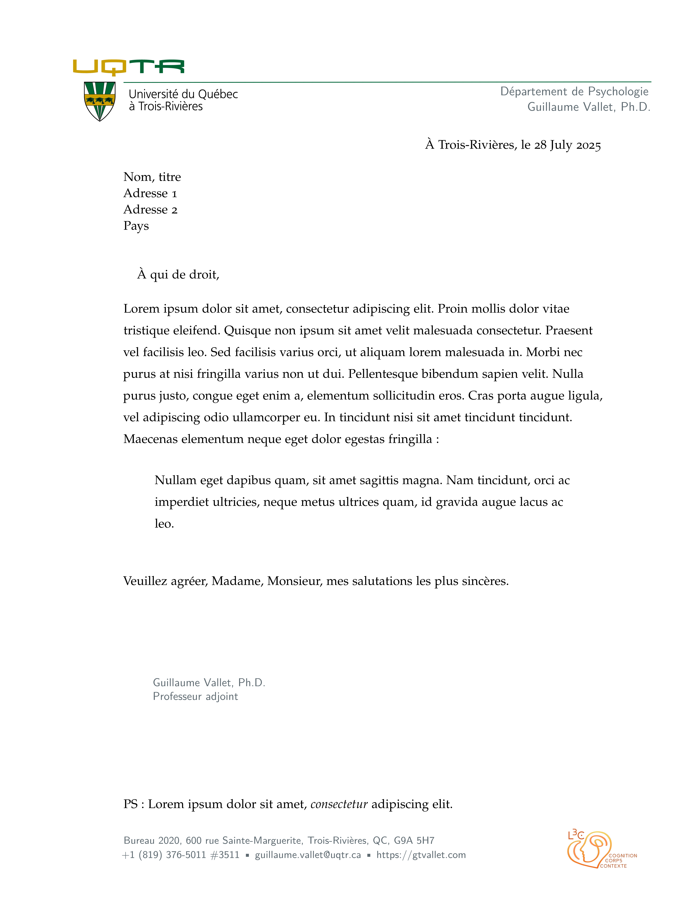

# L3C Quarto Letter

This is a Quarto template to write some official letter for the L3C Lab. 

## New letter

You can use this as a template to create a thesis report.

```bash
quarto use template l3c-uqtr/quarto-letter
```

This will install the extension and create an example qmd file that you can use as a starting place for your report.

## Installation for existing document

You may also use this format with an existing Quarto project or document.
From the quarto project or document directory, run the following command to install this format:

```bash
quarto install extension l3c-uqtr/quarto-letter
```

## Example

[](examples/template.pdf)